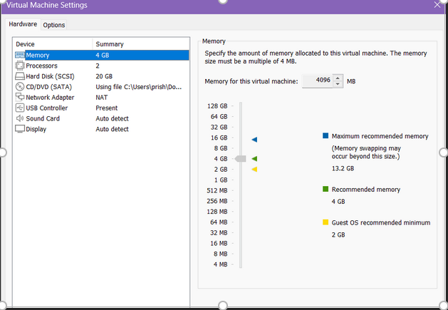

PRISHA RANA
CIS-106
FALL 2024
R.ALBERTO

# DELIVERABLE 2 SUBMISSION 
___________________
# SERVER SPECIFICATIONS 
___________________

__________________
# UBUNTU LOGIN SCREEN
.png)
___________________
# QUESTIONS
> What is the IP address of your Ubuntu Server Virtual Machine?
- 192.168.40.129

> How do you enable the Ubuntu Firewall?
- sudo ufw enable 

> How do you check if the Ubuntu Firewall is running?
- sudo ufw status
> How do you disable the Ubuntu Firewall?
- sudo systemctl disable firewalld

> How do you add Apache to the Firewall?
- sudo ufw allow 'Apache'

> What is the command you used to install Apache?
- sudo apt install apache2 -y

> What is the command you use to check if Apache is running?
- systemctl status apache2 --no-pager
- systemctl status ssh --no-pager
> What is the command you use to stop Apache?
- sudo systemctl stop apache2

> What is the command you use to restart Apache?
- sudo systemctl restart apache2

> What is the command used to test Apache configuration? 
- sudo apache2ctl configtest

> What is the command used to check the installed version of Apache?
- sudo apt install openssh-server -y
> What are the most common commands to troubleshoot Apache errors? Provide a brief description of each command.
- (check apanche status)
- sudo systemctl status apache2   # For Ubuntu
- sudo apache2ctl configtest (test apache configuration )
 
> Which are Apache Log Files, and what are they used for? Provide examples and screenshots.
- sudo echo "<html><head><title>My Resume Website</title></head><body><h1>This is a sample document!</h1></body></html>" > /var/www/myresume.index.html

