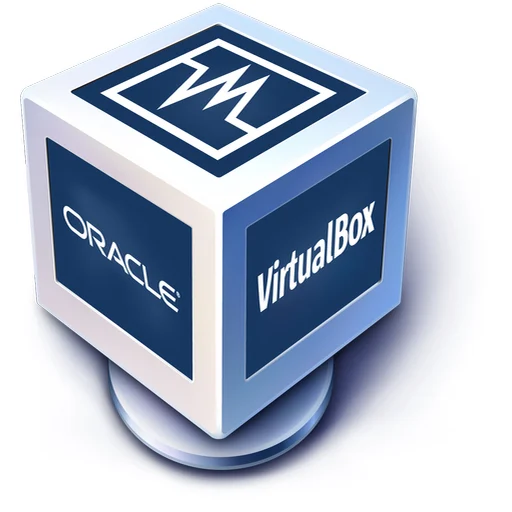

---
Student: Prisha Rana
semester: Fall 2024
Assignment: Final Project deliverable 1 

---

## What is a web server? Hardware and software side
- A web server is a system that delivers web content to users via the internet. From the Hardware side web server is The physical computer or server machine that stores website data. It processes incoming requests from clients such as web browsers and sends the requested content back. Modern servers can be physical machines or a virtual machines. 
## What are some different web server applications? 
- Here are different web server applications: 
- `Apache` = An open-source, widely-used web server known for its flexibility and extensive features.
- `Nginx`=  Lightweight and efficient, often used for handling high-traffic websites.
- `Microsoft IIS(internet information services)`= A web server for Windows-based systems.
- `Litespeed`= A high-performance web server alternative to Apache.
 
## What is virtualization?
- Virtualization is the act of making resources, for example, servers, operating systems, or networks to pretend as actual resources in a computers operating system. It can let one physical computer hold several virtual computers whereby each functions like a distinct machine.
## What is virtualbox? 
- VirtualBox is free, open-source virtualization software developed by Oracle. It allows users to create and run virtual machines on their computers. 
## What is a virtual machine? 
- A virtual machine (VM) is a software-based simulation of a physical computer. It runs as an isolated environment with its own operating system and resources (CPU, memory, storage).
Example: Running Ubuntu Server as a VM in VirtualBox on your laptop.
## What is Ubuntu Server? 
- Ubuntu Server is a version of the Linux-based Ubuntu operating system optimized for server environments. It does not include a graphical user interface (GUI) by default, making it lightweight and efficient for hosting web services (like Apache).
## What is a firewall? 
- A firewall is a security tool that filters incoming and outgoing network traffic to protect systems from unauthorized access.
## What is SSH?
- SSH (Secure Shell) is a protocol used to securely connect to remote servers over a network. It encrypts the connection between your computer and the server.

