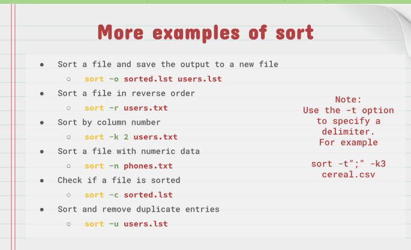
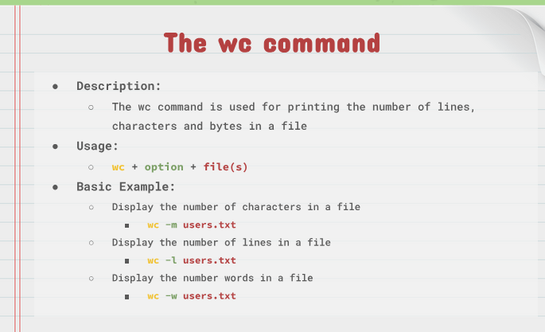
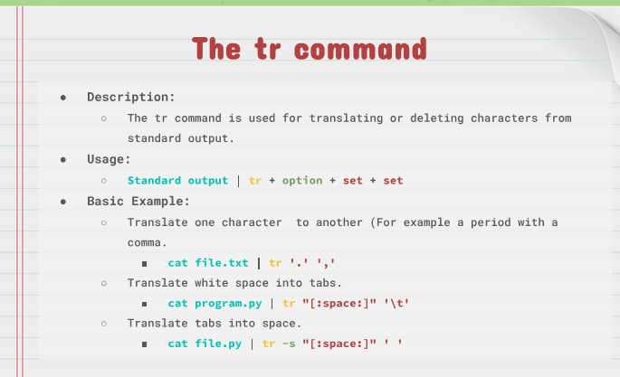
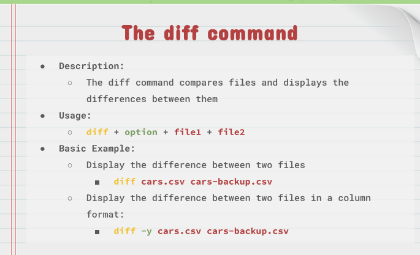
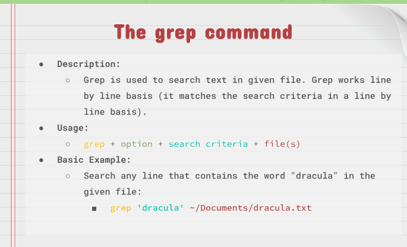

# NOTES 7

## cat
Description = cat command is used for displaying the content of a file. cat is shot for `concatenate` which is the cammads intended use.
usage: `cat + option + file(s) to display` 
Example = 
- dispplay the content of a file located in the pwd 
- `cat todo.lst`
- display the content of a file using absolute path 
- `cat ~/Documents/todo.lst`   
## tac
Description= used for displaying the content of a file in reverse order.
usage= `tac + option + files(s) to display`
example = 
- display the content of a file using absolute path 
  `tac todo.md`
## head
Description= displays the top N number of lines of a given file. by default it prints the first 10 lines. if more than one file name is provided then data from each file is preceded by its file name. 
usage= `head + option + file(s)`
example = display the first 10 lines of a file `head ~/Documents/Book/dracula.txt`
## tail
Description= displays the last N number of lines of given file. By default, it prints the last 10 line. if more than one file name is provided then data from each file is preceded by its file name. 
usage= `tail + option + file`
example = display the last 10 lines of a file `tail ~/Documents/Book/dracula.txt`
## cut
Description= used to extract a specific section of each line of a file and display it to the screen 
usage= `cut + option + files(s)`
example = display a list of all the users in your system `cut -d ':' -f1 /etc/passwd`
## sort
Description= used for sorting files. the sort command supports sorting: alphabetically, in reverse order, by number, and by month.  
usage= `sort + option + file`
example = `sort users.lst` 

## wc
description = used for printing the number of lines, characters and bytes in a file.
usage = `wc + option + files(s)`
example = 

## tr
description = used for translating or deleting characters from standard output. 
usage = `standard output | tr + option + set + set`
example = 

## diff
description = compares files and displays the differences between them. 
usage = `diff + option + files1 + file2`
example = 
## grep
description = used to search text in given file. grep works line by line basis. 
usage and example = 
